<div align="center">




<br/>


<a href="mailto:ghatekarabhishek0@gmail.com"></a>
<a href="https://github.com/newbie-del"></a>

</div>

<br/>

> **`root@abhi:~$ cat whoami.md`**
>
> Computer Engineering student building AI-powered applications, full-stack SaaS platforms, and data analytics solutions — from idea to deployment. Comfortable across the stack: data pipeline → LLM wiring → shipped UI.

<div align="center">

### ⚡ Tech Radar

</div>


<br/>

<div align="center">

### 🧠 `cat expertise.md`

</div>

| Domain | Focus |
| :-- | :-- |
| 🤖 **AI SaaS Development** | LLM integration, real-time voice agents, event-driven workflows |
| ⚙️ **Workflow Automation** | Drag-and-drop builders, async execution, multi-service integrations |
| 📊 **Data Analytics** | SQL, Excel dashboards, business-metric analysis at scale |
| 🧱 **Full-Stack Engineering** | Next.js/React front ends, tRPC/REST APIs, auth & billing |

<br/>

<div align="center">

### 🛠️ `tail experience.log`

</div>

```yaml
role:      Independent Projects & Coursework
period:    2025 – 2026
highlights:
  - Architected and shipped 3 full production-style SaaS/analytics projects
    end-to-end, from data pipeline / backend to deployed UI
  - Integrated LLM APIs (OpenAI, Gemini) and real-time voice infra (LiveKit)
    into a working product
  - Built analytics pipelines cleaning and modeling 8,500+ real-world
    records for business decision-making
tags: [AI Integration, Full-Stack, Data Analytics, SaaS Architecture]
```

<div align="center">

### 🎓 `cat education.yaml`

</div>

```yaml
degree:    BE, Computer Engineering
school:    Universal College of Engineering, Mumbai University
duration:  Aug 2023 – Present
cgpa:      6.00 / 10.00
```

<div align="center">

### 🔭 `cat current-focus.yaml`

</div>

```yaml
learning:
  - Machine Learning, NLP, and Generative AI fundamentals
  - MLOps and cloud AI workflows (Azure)

building:
  - AlphaLens AI — multi-agent financial intelligence platform
    (FastAPI, LangGraph, RAG)
  - ClickFlow — browser automation agent

open_to:
  - Data Analyst roles
  - AI Engineer / Full-Stack Engineer roles
```

<br/>

<div align="center">

### 📡 `github-stats --live`

<table align="center">
<tr>
<td></td>
<td></td>
</tr>
</table>


<br/><br/>

### 🏆 `cat achievements.log`


</div>

<br/>

<div align="center">


<sub>Built with ❤️ and a lot of ☕ — always shipping something new.</sub>

</div>
