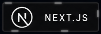
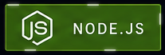
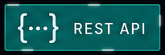
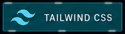
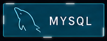

<div align="center">


<br/>


<a href="mailto:ghatekarabhishek0@gmail.com"></a>
<a href="https://github.com/newbie-del"></a>

</div>

<br/>


> **`root@abhi:~$ cat whoami.md`**
>
> Computer Engineering student building AI-powered applications, full-stack SaaS platforms, and data analytics solutions — from idea to deployment. Comfortable across the stack: data pipeline → LLM wiring → shipped UI.

### ⚡ Tech Radar

<div align="left">

#### 💻 PROGRAMMING LANGUAGES

<a href="https://www.python.org/" target="_blank"></a>
<a href="https://www.typescriptlang.org/" target="_blank"></a>
<a href="https://developer.mozilla.org/en-US/docs/Web/JavaScript" target="_blank"></a>
<a href="https://en.wikipedia.org/wiki/SQL" target="_blank"></a>

#### 🌎 WEB & BACKEND

<a href="https://nextjs.org/" target="_blank"></a>
<a href="https://react.dev/" target="_blank"></a>
<a href="https://nodejs.org/" target="_blank"></a>
<a href="https://developer.mozilla.org/en-US/docs/Glossary/REST" target="_blank"></a>
<a href="https://tailwindcss.com/" target="_blank"></a>

#### 🤖 AI / ML

<a href="https://openai.com/" target="_blank"></a>
<a href="https://ai.google.dev/gemini-api/docs" target="_blank"></a>
<a href="https://docs.langchain.com/oss/python/langgraph/overview" target="_blank"></a>
<a href="https://en.wikipedia.org/wiki/Natural_language_processing" target="_blank"></a>
<a href="https://en.wikipedia.org/wiki/Retrieval-augmented_generation" target="_blank"></a>
<a href="https://www.promptingguide.ai/" target="_blank"></a>
<a href="https://www.ibm.com/think/topics/agentic-ai" target="_blank"></a>

#### 🗄️ DATABASES & ORM

<a href="https://www.postgresql.org/" target="_blank"></a>
<a href="https://www.mysql.com/" target="_blank"></a>
<a href="https://neon.com/" target="_blank"></a>
<a href="https://orm.drizzle.team/" target="_blank"></a>
<a href="https://www.prisma.io/" target="_blank"></a>

#### ☁️ DATA & CLOUD

<a href="https://www.microsoft.com/microsoft-365/excel" target="_blank"></a>
<a href="https://www.microsoft.com/power-platform/products/power-bi" target="_blank"></a>
<a href="https://vercel.com/" target="_blank"></a>
<a href="https://azure.microsoft.com/" target="_blank"></a>

#### 🛠️ DEVELOPMENT TOOLS

<a href="https://git-scm.com/" target="_blank"></a>
<a href="https://github.com/" target="_blank"></a>
<a href="https://code.visualstudio.com/" target="_blank"></a>
<a href="https://www.kernel.org/" target="_blank"></a>
<a href="https://sentry.io/" target="_blank"></a>

#### 🛡️ CYBERSECURITY

<a href="https://www.wireshark.org/" target="_blank"></a>
<a href="https://www.metasploit.com/" target="_blank"></a>
<a href="https://portswigger.net/burp" target="_blank"></a>
<a href="https://nmap.org/" target="_blank"></a>
<a href="https://www.kali.org/" target="_blank"></a>

</div>

### 🧠 `cat expertise.md`

| Domain                        | Focus                                                               |
| :---------------------------- | :------------------------------------------------------------------ |
| 🤖 **AI SaaS Development**    | LLM integration, real-time voice agents, event-driven workflows     |
| ⚙️ **Workflow Automation**    | Drag-and-drop builders, async execution, multi-service integrations |
| 📊 **Data Analytics**         | SQL, Excel dashboards, business-metric analysis at scale            |
| 🧱 **Full-Stack Engineering** | Next.js/React front ends, tRPC/REST APIs, auth & billing            |

### 🛠️ `tail experience.log`

```yaml
role:      Independent Projects & Coursework
period:    2025 – 2026
highlights:
  - Architected and shipped 3 full production-style SaaS/analytics projects
    end-to-end, from data pipeline / backend to deployed UI
  - Integrated LLM APIs (OpenAI, Gemini) and real-time voice infra (LiveKit)
    into a working product
  - Built analytics pipelines processing and analyzing 12.2M+ real-world mortgage
    applications for credit risk insights and business decision-making
tags: [AI Integration, Full-Stack, Data Analytics, SaaS Architecture]
```

### 🎓 `cat education.yaml`

```yaml
degree:    BE, Computer Engineering
University:    Mumbai University
duration:  Aug 2023 – Present
```

### 🔭 `cat current-focus.yaml`

```yaml
learning:
  - Machine Learning, NLP, and Generative AI fundamentals
  - MLOps and cloud AI workflows (Azure)

building:
  - ClarityLedger — multi-agent financial intelligence platform
    (FastAPI, LangGraph, RAG)
  - ClickFlow — browser automation agent

open_to:
  - Data Analyst roles
  - AI Engineer / Full-Stack Engineer roles
```

### 📡 `github-stats --live`

<table align="center">
<tr>
<td></td>
<td></td>
</tr>
</table>

<p align="center">
  
</p>

<br/><br/>

### 🏆 `cat achievements.log`

 </div> <br/> <div align="center"> 

<sub>Built with ❤️ and a lot of ☕ — always shipping something new.</sub>

</div>

